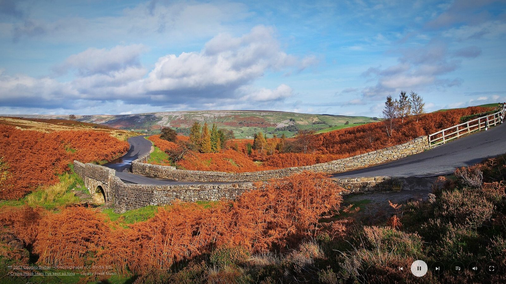
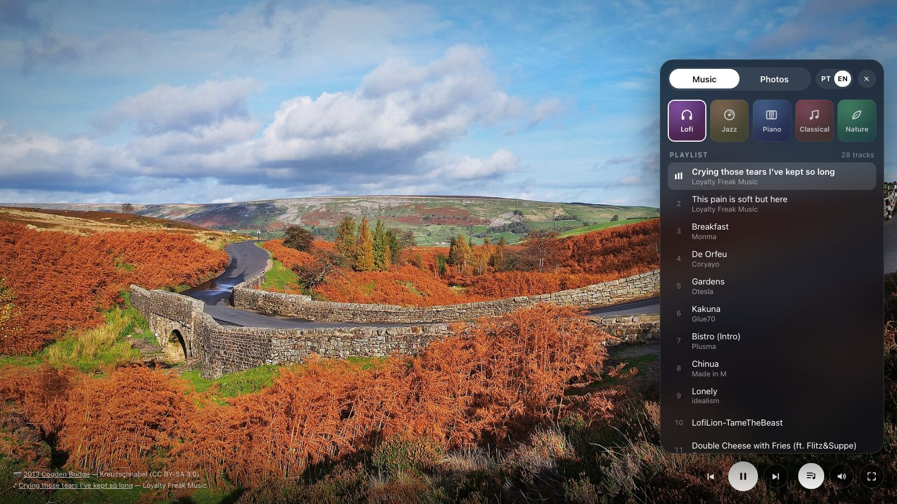

<div align="center">

# Armony Flow

**Turn any screen into a living picture frame.**
High-resolution landscapes that drift and dissolve into each other, over a soundtrack of free lofi, jazz, piano, classical or nature sounds.

[**▶ Open Armony Flow**](https://asaninc.github.io/armony-flow/)



</div>

## What it is

Armony Flow is a full-screen ambient web app. Open it on a TV, a monitor you're not using, or an iPad on a stand, press start, and let it run. Each photo stays on screen for about 25 seconds, with a slow zoom and pan (the Ken Burns effect). Then it crossfades into the next one. The controls and the cursor fade away when the mouse stops moving, so all you see is the picture.

It has no account, no ads, no API keys and no build step. It's three static files.

## Features

- 🖼 **Museum-grade photos**: only *Featured Pictures* from Wikimedia Commons, which are images the Commons community has voted among the best on the site. Photos are filtered to landscape orientation and at least 3000 px wide, and are served at 1280, 1920 or 3840 px depending on your screen and connection.
- 🎬 **Smooth motion**: slow zoom and pan in random directions, and 3-second crossfades. The next image is downloaded and decoded before the transition starts, so the fade doesn't stutter.
- 🎵 **Five music styles**: Lofi, Jazz, Piano, Classical and Nature. All tracks are Creative Commons or public domain, streamed from the Internet Archive.
- 🏔 **Photo styles**: Landscapes, Mountains, Water, Forests, Countryside, Cities or Everything. **Automatic** follows the time of day: sunrises in the morning, bright landscapes during the day, sunsets in the evening, and auroras and starry skies at night.
- ♥ **Favorites**: tap the heart on a photo you love. Favorites have their own style and also turn up now and then in the others.
- 🌧 **Nature sounds**: switch on rain, waves, birds or a crackling fireplace over the music, each with its own volume.
- 🔊 **Real volume control**, even on iPhone and iPad, where Safari normally ignores it (the audio goes through Web Audio).
- ⏱ **Time per photo**: 15 seconds, 30 seconds, 1 minute or 5 minutes.
- 🖼 **Frame mode**: the photo holds still inside a light or dark mat, like a framed print on the wall. The window in the mat is cut once for the screen and never moves; only the photo changes inside it. The clock becomes a single line printed on the mat under the photo.
- 🕰 **Clock**: an optional lock-screen style clock with the date, so the frame can sit on a desk.
- 🌙 **Sleep timer**: 15, 30 or 60 minutes. While it runs, a moon with the time left sits in the control bar. Over the last minute the music and the screen fade out, then everything pauses and the screen is allowed to turn off until someone taps it.
- 📺 **Show on TV**: in Chrome, sends the frame to a Chromecast or smart TV and turns your phone or computer into the remote. On Apple devices, the app points to Screen Mirroring.
- 📲 **Installable**: add it to your home screen or install it from Chrome. It opens without browser bars, and the last photos are kept so it can start on a shaky connection.
- 📃 **Playlist**: see what's playing, jump to any track, skip forward or back.
- 🫧 **Liquid Glass interface**: follows Apple's current design language. Controls float over the photo on clear glass, the settings panel uses regular glass, and everything stays monochrome so the landscape keeps the color. The start screen shows the first landscape blurred behind the title, and it comes into focus when you press Start.
- 🪶 **Lite mode**: swaps the live glass blur for solid surfaces. It's always on for TVs, Chromecast and low-memory devices, turns itself on if the crossfades stutter, and can be switched on or off in the Display tab everywhere else.
- 🎛 **Settings panel that fits any screen**: Music, Photos and Display tabs, style cards with cover photos, and a single scroll area. It opens as a floating panel on desktop and tablets, a sheet you can drag down to dismiss on phones held upright, and a side sheet on phones held sideways.
- 🌍 **English and Portuguese**: picked automatically from your browser language and time zone, and can be switched at any time.
- 🖥 **Made to run all day**: keeps the screen awake, hides the controls when idle, and works with media keys, Bluetooth headphones and the iPad lock screen.
- 📱 **Works on phones and tablets**: covers the whole screen on iPad and iPhone, notch and rounded corners included.



## Controls

| Button | Keyboard | What it does |
|---|---|---|
| ⏮ | `B` | Previous track (restarts the current one if it has played for more than 3 s) |
| ⏯ | `Space` | Pause or resume both the photos and the music |
| ⏭ | `N` | Next track |
| ☰ | `P` | Open the settings panel: music, photos and display settings |
| 🔊 | `M` | Mute / unmute |
| ⛶ | `F` | Full screen |
| ♡ | `L` | Add the current photo to your favorites |
| | `→` | Next photo |

Every setting (styles, volume, nature sounds, clock, time per photo, language, favorites) is remembered on each device.

> **Tip for iPad and iPhone:** in Safari, tap **Share → Add to Home Screen**. When you open Armony Flow from that icon it runs with no browser bars at all, which works best for a picture frame.

## Where the content comes from

Nothing is hosted in this repository. Photos and music are loaded directly from two open archives:

| | Source | License |
|---|---|---|
| Photos | [Wikimedia Commons: Featured pictures](https://commons.wikimedia.org/wiki/Commons:Featured_pictures) | Mostly CC BY-SA, some CC BY or public domain |
| Lofi | Chillhop Music, Loyalty Freak Music and others | CC0, CC BY, CC BY-NC, CC BY-NC-ND |
| Jazz | ProleteR, Kova, Boogie Belgique | CC BY-NC-ND 3.0 |
| Piano | Fabrizio Paterlini, Lee Rosevere, Candlegravity, Emil Davydov, Abigail Press | CC BY-NC-ND / BY-NC-SA / BY-ND |
| Classical | [Musopen](https://musopen.org): Chopin's complete works, plus symphonies | CC0, CC BY-SA 3.0 |
| Nature | Rain, ocean and bird recordings | CC0 |
| Nature sounds | Rain, waves, birdsong and fireplace recordings | CC0 |

Most of these licenses require attribution, so the photographer, license and current track are always shown in the corner, each linking to its original page. **Several music albums are licensed for non-commercial use only (NC).** If you fork this for a commercial product, remove those items from `MUSIC_STYLES` in `app.js`.

## Run it locally

Any static file server will do:

```bash
git clone https://github.com/asanInc/armony-flow.git
cd armony-flow
python3 -m http.server 8000
# open http://localhost:8000
```

To deploy, push to GitHub Pages, Cloudflare Pages, Netlify or any other static host. There's nothing to build.

## Make it yours

Every style is a short list at the top of [`app.js`](app.js).

**Add a photo style** by listing one or more Wikimedia Commons categories named `Category:Featured_pictures_of_<name>`:

```js
const PHOTO_STYLES = {
  // ...
  islands: { label: { pt: 'Ilhas', en: 'Islands' }, categories: ['islands', 'coasts'] },
};
```

**Add a music style** by listing [Internet Archive](https://archive.org) item identifiers (the part after `/details/` in the URL). Every MP3 in those items goes into the playlist:

```js
const MUSIC_STYLES = {
  // ...
  ambient: { label: 'Ambient', items: ['some-archive-item', 'another-one'] },
};
```

The slide duration, crossfade time, idle delay and default volume live in `CONFIG`.

## How it works

Armony Flow is plain HTML, CSS and JavaScript, with no framework and no dependencies. A few details that matter for something meant to run for hours:

- **Images are decoded before they're shown.** The `` that goes on screen is the same element that was preloaded and `decode()`d, so the browser never has to decode a large JPEG in the middle of a crossfade.
- **Animations run on the GPU.** The zoom is a Web Animations API transform, and the crossfade is an opacity transition, so both run on the compositor. A tiny `rotate(0.01deg)` stops Firefox from snapping the slow-moving layer to whole pixels, which would otherwise make the motion look jittery.
- **Glass costs nothing while you're not looking.** Blurring over a moving photo is expensive, so the glass controls use `visibility: hidden` when idle rather than only `opacity: 0`, which removes the blur entirely until you move the mouse or touch the screen.
- **Only two photos are ever in memory.** A decoded 3840 px photo takes about 30 MB, so the one that fades out is dropped as soon as the crossfade ends, and the next download waits until then too.
- **The CPU mostly sleeps.** The slideshow clock ticks four times a second instead of every frame, and the start screen leaves the page once the first photo is in.
- **Weak GPUs get lite mode.** TVs, streaming sticks and devices with 2 GB of memory or less start in it; elsewhere the first crossfades are timed, and under ~40 fps it switches on by itself. `?lite=1` or `?lite=0` forces it for testing.
- **It respects accessibility settings.** Reduce Transparency swaps the glass for solid surfaces, Increase Contrast strengthens text and edges, and Reduce Motion turns off the zoom-in reveal and the springy transitions.
- **Only one tab plays at a time.** A `BroadcastChannel` pauses other open copies of the app, so audio never doubles up.
- **Showing on a TV runs a second copy.** Chrome's Presentation API opens the app on the TV with `?receiver=1`; it starts by itself, hides the controls, and applies every setting and track change the remote sends. The remote keeps the photos on its own screen and goes quiet.
- **Photos start fast.** The first page of a category is enough to start. The rest loads in the background and is shuffled in ahead of the current photo.

```
index.html            markup and controls
style.css             layout, glass, transitions, settings panel
app.js                photos, music, nature sounds, clock, timer, TV, i18n, controls
sw.js                 service worker: offline start and photo cache
manifest.webmanifest  install metadata
icons/                app icon in every size
docs/                 screenshots for this README
```

## Credits

- Photos by the many photographers of [Wikimedia Commons](https://commons.wikimedia.org). The photo in the screenshots is *2013 Cogden Bridge* by Kreuzschnabel, [CC BY-SA 3.0](https://creativecommons.org/licenses/by-sa/3.0/). The cover photos on the style cards are Featured Pictures credited on their Commons pages.
- Music by the artists listed above, via the [Internet Archive](https://archive.org).
- Built with [Claude Code](https://claude.com/claude-code).
